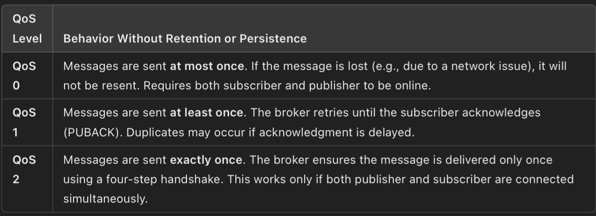

'''Software architectures in Go lang'''

**1. Layered architecture:**
We typically have 3 layeres in this type of distributed information systems
- Presentation layers: Providing interaction mechanism (Console in this case, otherwise user interface or aplication interface)
- Processing layer: Coordinate the application, process commands and implement logic
- Data layer: handle storage of data by using database or file system  (I have skipped this in my implementation)

Implemented TCP based client server layered architecture. interface at layer N, makes down call to  logic layer i.e server, which can make down call to data layer

**2. Object Based architectures**
- Objects can be created on different machines, and they can be accessed via method calls
- Objects typically have encapsulated state and they offer an interface , concealing implementation.
Exp: Java RMI (Remote method invocation)

What I have implemented?
In go lang, we don't have native RMI implementation, so I have used RPC to mimic the behavior.

Server - a machine, implements an interface that returns current Date
Client - another machine, that calls the server's object, and ultimately the method RPC

Steps: In Java

Server side:
- Create interface an interface
- Implement the interface
- Create Registery, and bind the implementation object to the registry 

Client side:
- Get Registry (by server IP and version)
- Lookup for the registry named that was registered by server
- Call the method by found registry 


**5. Pub/Sub**

- Download and install eclipse paho library to work with MQTT in go
- Install Eclipse mosquitto, an open source, light-weight broker
Run the broker

In publisher:
- Use ClientOptions struct to set Client ID, and set broker via AddBroker() method
- Then create a mqtt.NewClient(options) object, and connect with broker. Wait and catch errors if any
- Once connected, you can Publish messages via Publish(topic, qos, retained_msg,payload) method

In Subscriber
- Use ClientOptions to set Id, add broker address to client options
- Create ```go
NewClient
``` with options, and connect with broker. Wait and catch errors if any
- Once connected, you can Subscribe to topic via 
```go
Subscribe(topic, qos, fun(c mqtt.Client, c mqtt.Message){
    //c.Payload()
    //c.Topic()
})
```

3 QOS levels
1. 0 - at most once : When both subscriber and publisher are online, then message is sent once, but who knows if it was received or not? Nobody!

2. 1 - At least once: Guaranteed delivery, but duplications occur.
3. 2 - Exactly once: Guaranteed with no duplications - most reliable, resource consuming as 4 way handshake



Retained messages and Persistent sessions
- make retaine_message flag True in Publisher's Publish method
- make SetCleanSession(false) in subscriber's options 
With this setting, the messages will be delivered even if client is offline, later it will receive when it becomes online

More options
# SetWill (Last Will and Testament):
The Will message (Last Will and Testament) is a special message that is sent by the broker on behalf of a client if the client unexpectedly disconnects. It is used to notify other clients about the abnormal disconnection of a client.
```go
opts.SetWill("status/clients", "publisher disconnected unexpectedly", 1, true)
```

SetKeepAlive
The KeepAlive option defines the maximum interval (in seconds) between messages sent from the client to the broker. These messages act as heartbeats to let the broker know that the client is still alive and connected.
- To maintain the connection between the client and broker.
- To detect and recover from broken connections quickly.
- To prevent unnecessary disconnections due to inactivity.