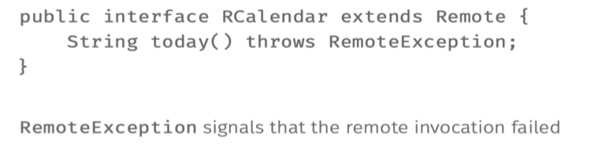
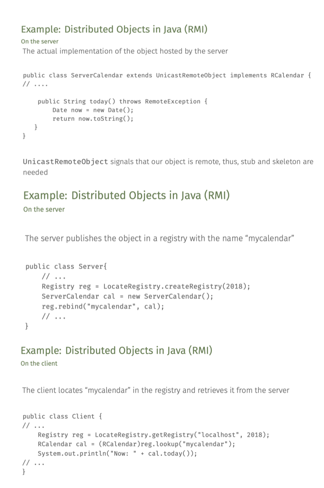

'''Software architectures in Go lang'''

**1. Layered architecture:**
We typically have 3 layeres in this type of distributed information systems
- Presentation layers: Providing interaction mechanism (Console in this case, otherwise user interface or aplication interface)
- Processing layer: Coordinate the application, process commands and implement logic
- Data layer: handle storage of data by using database or file system  (I have skipped this in my implementation)

Implemented TCP based client server layered architecture. interface at layer N, makes down call to  logic layer i.e server, which can make down call to data layer

2. Object Based architectures
- Objects can be created on different machines, and they can be accessed via method calls
- Objects typically have encapsulated state and they offer an interface , concealing implementation.
Exp: Java RMI (Remote method invocation)

What I have implemented?
In go lang, we don't have native RMI implementation, so I have used RPC to mimic the behavior.

Server - a machine, implements an interface that returns current Date
Client - another machine, that calls the server's object, and ultimately the method RPC

Steps: In Java

Server side:
- Create interface an interface
- Implement the interface
- Create Registery, and bind the implementation object to the registry 

Client side:
- Get Registry (by server IP and version)
- Lookup for the registry named that was registered by server
- Call the method by found registry 

